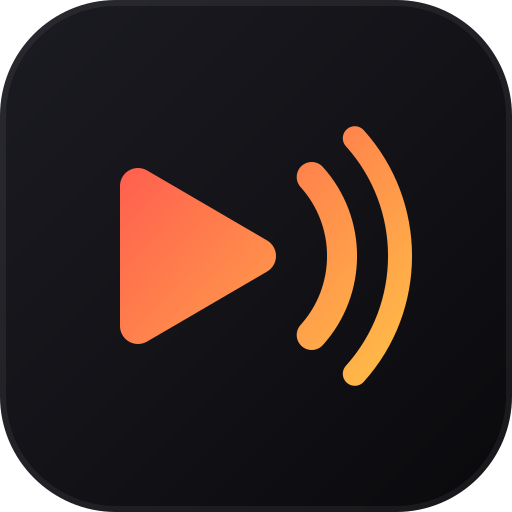
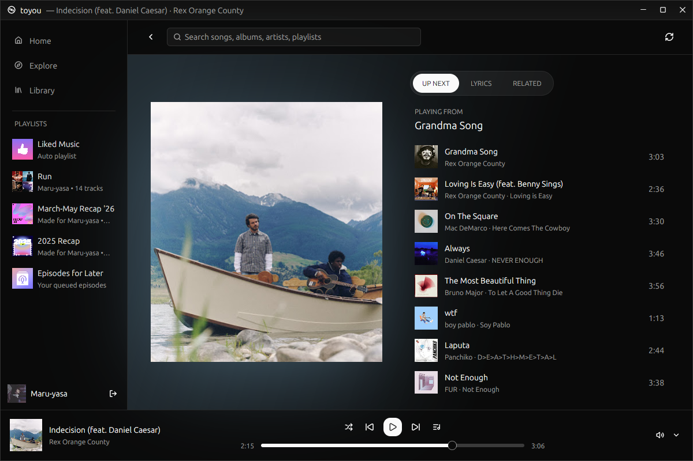
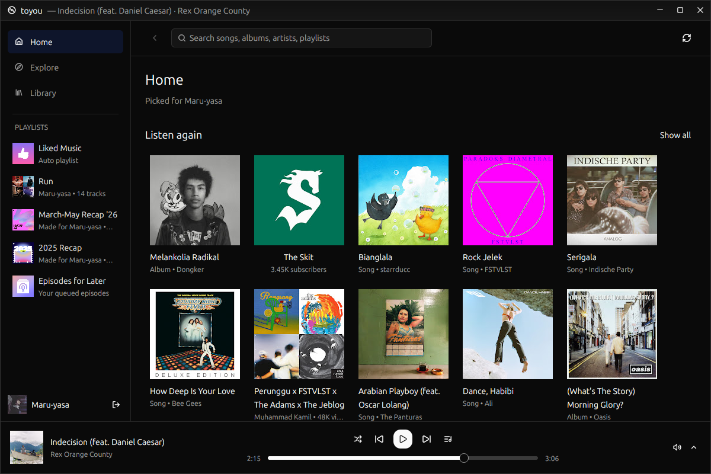
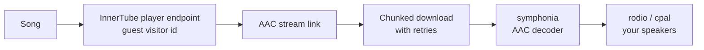

<div align="center">



# toyou

**A lightweight, native YouTube Music client for the desktop.**
Built in Rust on [GPUI Kit](https://gpui-kit.com) (Zed's GPU-accelerated UI framework).


</div>

---

toyou plays YouTube Music without a browser tab. It talks to YouTube Music directly, plays
audio with its own engine, and draws everything with the GPU. It needs no mpv, no yt-dlp and no
Electron.

<p align="center">
  
</p>
<p align="center">
  
</p>

## Features

**Browse**
- **Home** with your personal picks when signed in: Quick picks, mixes, Listen again.
  More sections load as you scroll.
- **Explore** for new releases, charts, and moods & genres.
- **Library** with your playlists and Liked Music, also pinned in the sidebar.
- **Search** grouped into top result, songs, artists, and albums & playlists.
- Album, playlist and artist pages with **Play** and **Shuffle**.

**Now playing**
- Large artwork, with the view tinted in the song's own color.
- **Synced lyrics** that follow the song: the active line grows and brightens, the view
  scrolls smoothly, and clicking a line jumps to it.
- **Up next** shows where the queue plays from. **Related** suggests similar songs and artists.

**Player**
- Clicking a song starts a radio of suggestions, and the queue keeps itself filled.
- Seek, shuffle, and a volume popover with mute.
- Your queue, song, position and volume are restored when you reopen the app.
- **Media keys and Bluetooth earbuds** work, and the song shows in your desktop's media
  controls (MPRIS).

**Keyboard first**
- **Ctrl+P** searches YouTube Music from anywhere.
- **Ctrl+Shift+P** opens the command palette, which lists every action with its shortcut.

## Install

toyou is built from source. On Debian or Ubuntu:

```sh
sudo apt install libasound2-dev libxkbcommon-x11-dev libwebkit2gtk-4.1-dev libgtk-3-dev
git clone https://github.com/Maru-Yasa/toyou.git
cd toyou
cargo run --release
```

This builds two programs in `target/release/`: `toyou`, the app, and `toyou-login`, the
sign-in window it opens. Keep them in the same folder.

## Signing in

Choose **Sign in with Google** to open a small browser window with Google's own sign-in
page. toyou never sees your password. When you finish, it keeps only your YouTube session
cookies and closes the window. You can also paste a `Cookie` header from your browser, or
skip signing in and listen as a guest.

| What | Where |
| --- | --- |
| Session cookies (YouTube only, readable only by you) | `~/.config/toyou/cookies.txt` |
| Sign-in window's browser profile | `~/.config/toyou/webview/` |
| Queue, position and volume | `~/.config/toyou/state.json` |

Signing out deletes the session cookies.

## Keyboard shortcuts

| Keys | Action |
| --- | --- |
| <kbd>Ctrl</kbd>+<kbd>P</kbd> | Search songs |
| <kbd>Ctrl</kbd>+<kbd>Shift</kbd>+<kbd>P</kbd> | Command palette |
| <kbd>Ctrl</kbd>+<kbd>K</kbd> | Focus the search bar |
| <kbd>Ctrl</kbd>+<kbd>Space</kbd> | Play / pause |
| <kbd>Ctrl</kbd>+<kbd>.</kbd> | Next song |
| <kbd>Ctrl</kbd>+<kbd>,</kbd> | Previous song |
| <kbd>Alt</kbd>+<kbd>←</kbd> | Back |
| <kbd>F12</kbd> | FPS counter |

## How playback works



Each song's stream is requested straight from YouTube's InnerTube API. The audio downloads in
1 MB pieces on a background thread, so the decoder never waits on the network inside the sound
card's callback. Decoding and output are pure Rust.

## Project layout

A Cargo workspace with one crate per domain:

| Crate | Responsibility |
| --- | --- |
| [`toyou`](crates/toyou) | The app binary and the `toyou-login` sign-in binary |
| [`views`](crates/views) | App state and every screen: sidebar, pages, sign-in, player bar, Now playing, palettes |
| [`state`](crates/state) | Plain state types: page loading, on-demand fetches, Now playing tabs |
| [`router`](crates/router) | The pages toyou can show |
| [`ui`](crates/ui) | Shared UI pieces: theme palette, lazy album art, artwork colors, window edges |
| [`input`](crates/input) | Actions and key bindings |
| [`icons`](crates/icons) | Bundled icons |
| [`music`](crates/music) | YouTube Music client: home, explore, search, pages, radio, lyrics |
| [`player`](crates/player) | Audio engine: stream lookup, chunked download, decoding, output |
| [`mpris`](crates/mpris) | Media controls for the desktop: media keys, Bluetooth earbuds, GNOME's media panel |
| [`auth`](crates/auth) | Session cookies and their validation |
| [`storage`](crates/storage) | Saves and restores the playback session |
| [`webview`](crates/webview) | The Google sign-in window (WebKitGTK via wry) |

## Development

```sh
cargo build --workspace                            # everything
cargo test --workspace                             # offline tests
cargo test --workspace -- --ignored --nocapture    # live tests against YouTube Music
TOYOU_FPS=1 cargo run --release                    # start with the FPS counter on
```

## Memory and performance

Profiled with the [dhat](https://docs.rs/dhat) heap profiler, signed in, with Home loaded and
no playback.

**toyou's own data is small.** At the end of a 35-second run in a release build, 11.1 MB was
live in Rust allocations (12.4 MB at the peak). By owner, from a symbolized debug run:

| What | Live |
| --- | --- |
| Audio buffer of the current song | ~5 MB |
| Decoded album art | ~5 MB |
| Text layout, layout tree, GPU shaders | ~3.5 MB |
| Downloaded (still encoded) covers | ~0.8 MB |

**The rest of the process memory isn't toyou's data.** The process held about 59 MB of
private memory at that point, and can reach 100–120 MB after a long session. Most of it is:

- C libraries the profiler can't see: the Mesa/Vulkan GPU driver, fontconfig/freetype and the
  X11 keyboard libraries.
- Freed memory that glibc keeps. Drawing allocates and frees a lot of short-lived data:
  286 MB in 35 seconds, mostly layout (taffy) and text shaping. glibc keeps a pool per thread
  and holds on to freed pieces.

What toyou does about it:

- On Linux it caps glibc at two memory pools and returns freed memory to the system every 30
  seconds. This hasn't been measured in a long, visible session yet.
- Album art is downloaded at the size it's drawn and only once it's on screen. At most 150
  covers stay in memory.
- Pages and the sidebar are cached views, so the once-a-second clock tick only redraws the
  player bar. Up next is a virtual list that only draws the rows on screen.

Press <kbd>F12</kbd> for the FPS counter. While it's on, toyou redraws continuously, so it
shows the worst case.

## Limitations

- Tested on Linux (Ubuntu, GNOME on Wayland). Other platforms are untested.
- Audio is AAC at about 128 kbps.
- Streams come from a YouTube client that currently works without extra verification. If
  YouTube changes that, playback will need an update.
- Saving the up-next queue as a playlist isn't supported yet.

## Disclaimer

toyou is an independent project. It isn't affiliated with, endorsed by, or sponsored by
Google or YouTube. "YouTube" and "YouTube Music" are trademarks of Google LLC.

## License

[MIT](LICENSE) © 2026 Maru-Yasa
